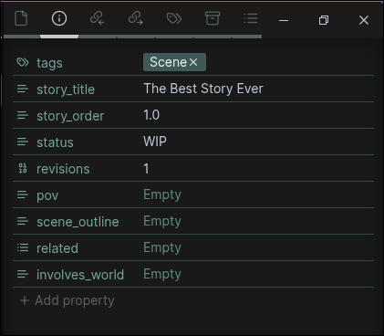

# Lorekeeper
An Obsidian vault template for worldbuilding, creative writing, and research.

## Goals
There were a lot of excellent options out there related to TTRPGs, but I needed a system combining writing with worldbuilding, which is how this came to be.

This system is highly tailored to my own needs, but as is the nature of Obsidian, anything can be changed to your liking, or at least used as a reference point on what is possible.

This vault tries to do most of the heavy lifting on organization, metadata tracking, and linking notes out of the box so that you can focus on the actual writing and ideas. Accomplished through a large set of custom templates, scripts, and useful plugins ready to use.

## Dashboard Preview

*Note*: These images were all sourced from the internet, they are semi-placeholders as I plan to draw them all myself. (Eventually, when I've developed my drawing skills enough, because I don't want to use AI).

## Features
- A visually appealing homepage to navigate the vault
- Custom theme-agnostic CSS — works with any Obsidian theme
- Dashboard-style pages for stories and the homepage with hero banners, card grids, and multi-column layouts
- Manuscript-style page appearance for scene writing
- Buttons for commonly used templates and commands
- Story-aware notes system — attach any note type (plot, brainstorm, research, etc.) to a story
- Scene writing with focus mode, manuscript compilation, and word count tracking
- Character management with relationship tracking
- Worldbuilding across 20+ categories with rich metadata
- Automated linking and cross-referencing
- Property editing through Obsidian Bases indexes, with Meta Bind for linking fields
- ... and much more.

## Installation
1. Download or clone this repository
2. Open the vault in Obsidian
3. When prompted to enable plugins, click yes.
4. Reload the vault to fix any visual oddities

## Usage
In terms of customizability, you can get the most out of the vault if you have existing knowledge of Obsidian features such as templates and Bases, and plugins like Templater and Meta Bind.

However, I tried my best to make it as comprehensive and user-friendly as possible, given the complexity. There are many written resources within the vault itself to get an understanding of the structure and organization system. I recommend simply playing around with it and seeing how it works.

Be sure to reference the `Master Tags List` note if you are ever confused on what a metadata property is supposed to contain.

### Story Writing Workflow
The vault separates **planning** from **writing** to keep your creative process organized.

**Basic workflow:**
1. **Create a Story dashboard** — use the "Create New Story" button. This becomes your central hub with scene tracking, word counts, progress stats, and related notes.
2. **Plan with notes** — from the story dashboard, click "New Note for Story" to create plot outlines, brainstorms, research notes, or any other note type attached to your story. These live in `Notes/` and appear in the Related Notes section of your dashboard.
3. **Write with Scene notes** — each scene is a separate note containing only prose, styled with a manuscript page appearance and auto-focused for distraction-free writing.
   - Use `story_order` property (e.g. `1.2.3` for Chapter 1, Scene 2, Beat 3) to organize scenes. This is necessary for automated manuscript compilation.

   - For these notes, edit properties in the "File Properties" view. By default, properties are hidden at the top of the document for a cleaner writing experience. Press `CTRL+SHIFT+P` to reopen it if needed.
   - The first number determines chapter grouping in your manuscript
4. **Track progress** on your Story dashboard — see word counts, scene status, and all related notes at a glance
5. **Compile manuscript** — click the Compile button to automatically generate a manuscript with chapter headings and all scenes embedded in order
6. **Export** using the Pandoc plugin to DOCX, PDF, or ePub formats

**Multiple Drafts**:
There are multiple ways you could approach this, and I admit I haven't found the single best way to do so yet, but here are some ideas:
- Use the `revisions` property to track how many times you've revised a scene, and duplicate the scene before a major revision if you want to save its contents. You can easily filter out older revisions in Bases queries over time.
- Keep one note per scene, but organize revisions underneath headings (i.e. `# Revision 1`, `# Revision 2`, etc.), pushing older revisions down. Convenient for keeping everything in one note, but requires cleanup before export.

**Key concepts:**
- **Notes** (with `note_purpose`) = planning, outlines, brainstorms, research — any supporting work attached to a story via `story_title`
- **Scene notes** = actual prose that appears in your final manuscript
- **story_order** format: `chapter.scene.beat` (e.g. `1.1`, `2.3.1`)
	- Using just chapters (e.g. `1.0`, `2.0`) or scenes (e.g. `1.1`, `1.2`) is sufficient for most cases
- **Compilation** seamlessly stitches all scenes together using Obsidian's embed syntax

#### Useful Plugins for Writing
- **LanguageTool** - Enhanced spelling and grammar checking. Note: for privacy reasons, this uses an external API by default (though self-hosting options exist).
- **Pandoc** - Exports your notes into manuscript format with various output options. Use the "Compile Manuscript" button in your Story dashboard to automatically combine all scenes before exporting.
- **Smart Typography** - Keyboard shortcuts for typographic symbols like em dashes and ellipses.
- **Keep The Rhythm** - Shows lots of visually appealing statistics of word count.
- **Focus Mode** - Distraction-free writing, toggled automatically when creating new scenes.

### Worldbuilding Workflow
Each "World" note belongs to a category connected to the homepage. These notes are metadata-heavy to allow for complex queries, but the body of the note itself remains flexible.

1. Click the "New World Note" button and choose your category, or manually insert a template
2. Open the "Metadata" callout at the top of the note and fill out relevant information
   - All fields are optional - don't stress about completing everything if it isn't relevant
   - You can always update metadata later
   - Meta Bind fields are mainly used for linking and relationship properties
   - Other properties are most conveniently edited through index pages (Obsidian Bases) or the Properties view
3. Add content to the body of the note - use the provided template headings or delete them and create your own structure
4. That's it! The note will automatically appear in its relevant database

### Notes System
General-purpose notes live in `Notes/` and can optionally be attached to a story:
- **"New Note"** button — creates a standalone note (blank, brainstorm, documentation, planning, reference, research, or plot)
- **"New Note for Story"** button — prompts you to pick a story first, then a note type. The note gets a `story_title` and appears in that story's Related Notes section

### Customizing the Vault Visually
- **Homepage images**: Replace the image files rather than editing the syntax. Images are stored in `Assets/Banners/` in the format `card-[category]` (e.g. `card-character` for Characters)
- **Homepage banner**: Easily customized through the Pixel Banner plugin
- **Color theme**: Change the "Accent Color" value in Settings → Appearance to update most of the vault's color palette

#### Custom CSS
The vault ships with its own CSS snippets (`lorekeeper-*.css`) that provide all visual styling independent of any theme:
- **lorekeeper-tokens** — design tokens (colors, spacing, radii) referenced by all other snippets
- **lorekeeper-dashboard** — dashboard page layout, hero banners, info columns, highlight bars
- **lorekeeper-callouts** — card grids, navbars, metadata sections, action buttons, multi-column layouts
- **lorekeeper-infobox** — styled infoboxes for world notes
- **lorekeeper-utilities** — centered headings, manuscript page style, print cleanup

These snippets use `--lk-*` CSS variables with fallbacks, so you can use any base theme (or none) and the vault will look correct.

## Disclaimer
Some parts of the vault contain placeholder images from various internet sources used for demonstration purposes only. I do not claim any ownership of them. This project is intended for personal, non-commercial use.
