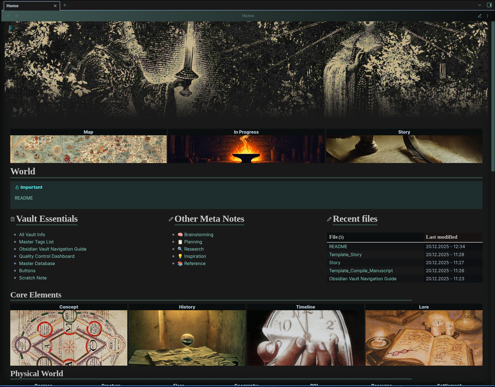

# Lorekeeper
An Obsidian vault template for worldbuilding, creative writing, and research. 

## Goals
There were a lot of excellent options out there related to TTRPGs, but I needed a system combining writing with worldbuilding, which is how this came to be.

This system is highly tailored to my own needs, but as is the nature of Obsidian, anything can be changed to your liking, or at least used as a reference point on what is possible.

This vault tries to do most of the heavy lifting on organization, metadata tracking, and linking notes out of the box so that you can focus on the actual writing and ideas. Accomplished through a large set of custom templates, scripts, and useful plugins ready to use.

## Dashboard Preview

*Note*: These images were all sourced from the internet, they are semi-placeholders as I plan to draw them all myself. (Eventually, when I’ve developed my drawing skills enough, because I don’t want to use AI).

## Features
- A visually appealing homepage to navigate the vault 
- Buttons for commonly used templates and commands
- Character management with relationship tracking
- Timeline and chronology system
- Story and chapter organization with manuscript compilation
- Research and planning notes
- Automated linking and cross-referencing
- ... and much more.

## Installation
1. Download or clone this repository
2. Open the vault in Obsidian
3. When prompted to enable plugins, click yes.

## Usage
In terms of customizability, you can get the most out of the vault if you have existing knowledge of Obsidian features such as templates and Bases, and plugins like Templater and MetaBind.

However, I tried my best to make it as comprehensive and user-friendly as possible, given the complexity. There are many written resources within the vault itself to get an understanding of the structure and organization system. I recommend simply playing around with it and seeing how it works.

### Story Writing Workflow
The vault separates **planning** (Plot notes) from **writing** (Scene notes) to keep your creative process organized. Scene notes are minimalist for a cleaner writing experience. 

**Basic workflow:**
1. **Create a Story dashboard** using the Story template (use "New Story Note" button) - this becomes your central hub
2. **Plan with Plot notes** - outline chapters, character arcs, themes, and story structure
3. **Write with Scene notes** - each scene is a separate note containing only prose
   - Use `story_order` property (e.g. `1.2.3` for Chapter 1, Scene 2, Beat 3) to organize scenes
   - The first number determines chapter grouping in your manuscript
   - *Tip:* `Ctrl+R` toggles readable line length for a more comfortable writing experience
4. **Track progress** on your Story dashboard - see all scenes sorted by order with status and revision counts
5. **Compile manuscript** - click the Compile button to automatically generate a manuscript with:
   - Chapter headings based on `story_order`
   - All scenes embedded in order
   - Proper metadata for export
6. **Export** using the Pandoc plugin to DOCX, PDF, or ePub formats

**Key concepts:**
- **Plot notes** = planning, outlines, meta-work
- **Scene notes** = actual prose that appears in your final manuscript
- **story_order** format: `chapter.scene.beat` (e.g. `1.1`, `2.3.1`)
	- Using just chapters (e.g. `1.0`, `2.0`) is sufficient for most cases, but you can partition however you want
- **Compilation** seamlessly stitches all scenes together using Obsidian's embed syntax

#### Useful Plugins for Writing
Note: Some of these are disabled by default but come preinstalled - enable them based on your preferences.

- **Easy Typing** - Auto-formatting features like automatic capitalization of the first letter in each sentence. *Disabled by default.*
- **LanguageTool** - Enhanced spelling and grammar checking. Note: for privacy reasons, this uses an external API by default (though self-hosting options exist). *Disabled by default.*
- **Novel Word Count** - Displays total word count per folder and file in the File Explorer for tracking progress. *Disabled by default.*
- **Pandoc** - Exports your notes into manuscript format with various output options. Use the "Compile Manuscript" button in your Story dashboard to automatically combine all scenes before exporting. *Enabled by default.*
- **Smart Typography** - Keyboard shortcuts for typographic symbols like em dashes and ellipses. *Enabled by default.*

### Worldbuilding Workflow
Each "World" note belongs to a category connected to the homepage. These notes are metadata-heavy to allow for complex queries, but the body of the note itself remains flexible.

1. Click the "New World Note" button and choose your category, or manually insert a template
2. Open the "Metadata" callout at the top of the note and fill out relevant information
   - All fields are optional - don't stress about completing everything if it isn't relevant
   - You can always update metadata later
   - Some information will automatically populate the infobox
3. Add content to the body of the note - use the provided template headings or delete them and create your own structure
4. That's it! The note will automatically appear in its relevant database

### Customizing the Vault Visually
- **Homepage images**: Replace the image files rather than editing the syntax. Images are stored in `Assets/Banners/` in the format `card-[category]` (e.g. `card-character` for Characters)
- **Homepage banner**: Easily customized through the Pixel Banner plugin
- **Color theme**: Change the "Accent Color" value in Settings → Appearance to update most of the vault's color palette. For infobox colors, use Style Settings
- **Style Settings**: The Style Settings plugin offers many customization options for the ITS theme and infoboxes

## Disclaimer
Some parts of the vault contain placeholder images from various internet sources used for demonstration purposes only. I do not claim any ownership of them. This project is intended for personal, non-commercial use.